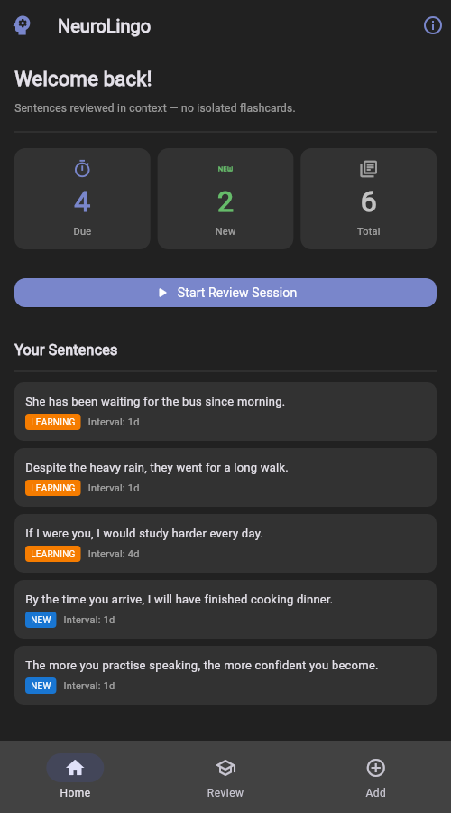

# NeuroLingo

[](https://github.com/mohammadgheisari1994/NeuroLingo/actions/workflows/ci.yml)

A cross-platform, offline-capable English learning app for Farsi speakers — built on
spaced repetition, sentence-context vocabulary, and a provider-agnostic LLM tutor that
keeps working even with no internet connection and no API key.



---

## Highlights

- **Provider-agnostic LLM routing with offline failover** — a single router cascades across Anthropic, OpenAI, and Gemini, then falls back to a local GGUF model via `llama.cpp` if every cloud provider is unreachable or unconfigured, so the app stays fully functional with no network connection and no API key.
- **RAG built from scratch for mobile binary-size limits** — no PyTorch, FAISS, or sentence-transformers. Retrieval runs on 4096-dimension hashing-trick embeddings over a pure NumPy vector store, with cosine similarity computed as a single matrix product.
- **SM-2 spaced repetition + repository-pattern data layer** — an Anki-compatible SM-2 scheduling engine on top of a WAL-journaled SQLite repository with cascading foreign keys, covered by 127 passing tests (1.6s suite), packaged cross-platform via Flet/Flutter and PyInstaller.

## Architecture

```
neurolingo/
├── core/
│   ├── srs/      SM-2 spaced-repetition algorithm (pure Python, no dependencies)
│   ├── llm/      LLMProvider ABC + LLMRouter — cloud providers with local llama.cpp fallback
│   └── rag/      EmbeddingProvider + VectorStore ABCs — hashing embeddings, NumPy cosine search
├── db/           SQLite repository (context-manager connections, FK + WAL enabled)
├── ui/           Flet UI (desktop / web / mobile from one Python codebase)
└── audio/        Voice-shadowing module (planned)
```

**Request flow for AI tutoring:** a request first tries the user's preferred cloud
provider; on an auth error, timeout, or rate limit it fails over to the next configured
provider; if every cloud provider fails, it falls back to the local `llama.cpp` model —
every hop is logged so it's clear which provider actually answered.

**Request flow for retrieval:** text is embedded with the hashing trick (tokenize →
MD5-hash into a fixed 4096-slot vector → L2-normalize), then compared against the
in-memory NumPy matrix via one vectorized cosine-similarity pass — no external index or
GPU required.

## Installation

### Prerequisites

- Python ≥ 3.11
- (Optional) API keys for cloud LLM providers
- (Optional) A GGUF model file for offline AI tutoring

### Setup

```bash
git clone https://github.com/mohammadgheisari1994/NeuroLingo.git
cd NeuroLingo

# Full install (all features, heavy ML deps)
pip install -r requirements.txt

# Launch the app
python3 main.py
```

### Lightweight / mobile build

For cross-platform builds targeting iOS/Android, skip the heavy ML packages:

```bash
pip install flet python-dotenv numpy
python3 main.py          # offline mode: hashing embeddings, no cloud LLM
```

### Optional: local LLM (100% offline AI tutoring)

Download any GGUF model (e.g. `phi-3-mini-4k-instruct.Q4_K_M.gguf`) and set:

```bash
# macOS Metal GPU acceleration
CMAKE_ARGS="-DLLAMA_METAL=on" pip install llama-cpp-python

# CPU-only (all platforms)
pip install llama-cpp-python

export LOCAL_MODEL_PATH="/path/to/your-model.gguf"
```

### Optional: cloud AI tutoring

Create a `.env` file in the project root:

```env
ANTHROPIC_API_KEY=sk-ant-...
OPENAI_API_KEY=sk-...
GEMINI_API_KEY=...

LLM_PREFERRED=anthropic          # anthropic | openai | gemini | local
LOCAL_MODEL_PATH=/path/to/model.gguf
```

## Testing

```bash
pip install -r requirements-ci.txt

python3 -m pytest tests/unit/ -v
python3 -m pytest tests/unit/ --cov=neurolingo --cov=logger_config --cov-report=term-missing
ruff check .
```

## Contributing

Every change (however small) follows a branch → PR → merge → delete-branch cycle; see
[DEVELOPMENT_RULES.md](DEVELOPMENT_RULES.md) for the full engineering, workflow, and agent rules
this repo follows.

## Module status

| Module | Status |
|---|---|
| Scaffold + logging | ✅ |
| Database + SRS | ✅ |
| LLM router + RAG | ✅ |
| Comprehensible-input / review / add UI | ✅ |
| Shadowing (audio) | 🔲 planned |
| Settings / onboarding | 🔲 planned |

## License

MIT
